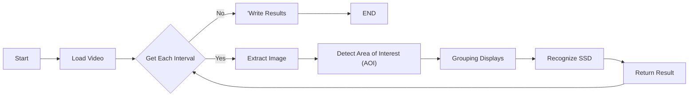
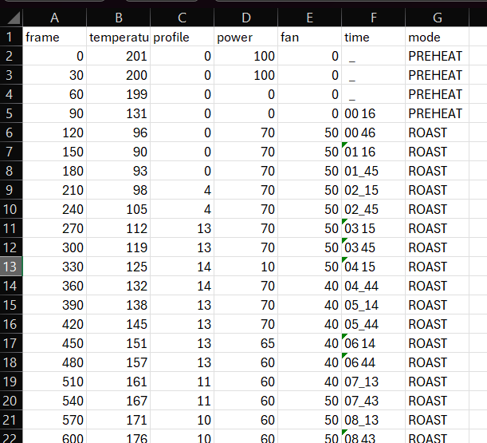
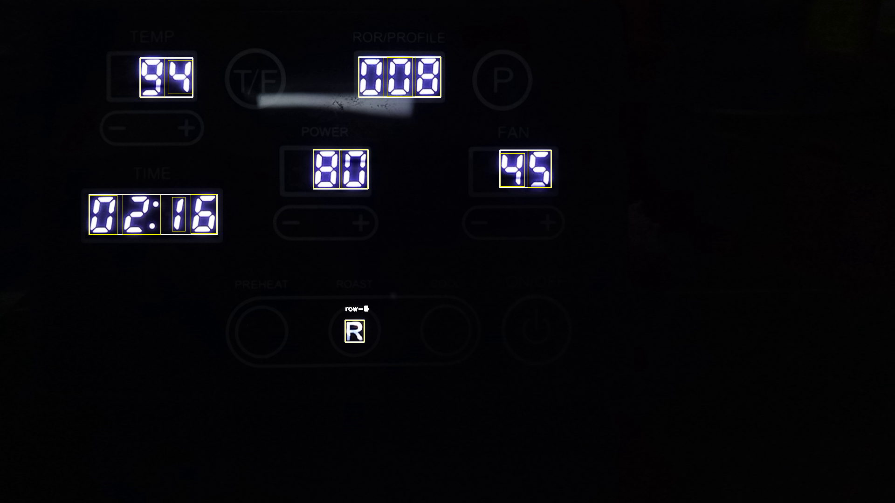
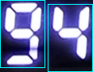
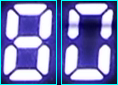
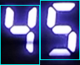
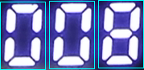
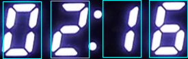
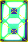

# Skylogger - Python, OpenCV2, PaddleOCR

## Overview

An Itop Skywalker coffee roaster logger. 

[AI Version](https://github.com/sanekee/skylogger-paddle)

Extract roasting profile using OpenCV2 image processing to recognize seven segment display digits from the coffee roaster control panel.



## Sample



## Usage

1. Using Dev Container
2. runs with python3 main.py &lt;input video&gt; &lt;output path&gt;<br/>
   **Args**:
   | Arg        | Description                           |
   |------------|---------------------------------------|
   | --rotate   | Rotate image [auto,<number of degree] |
   | --interval | Extract frame every second            |
   | --skip     | Skip seconds from beginning of video  |
   | --count    | Number of frame to extract            |
   | --debug    | Output debugging images               |

   Example:
    ```shell
    python3 main.py video.mp4 output --debug=true  --rotate=auto --skip=5 --count=10 --interval=30
    ```

## Implementation

### 1. Detect Area of Interest (AOI)



### 2. Extract Digits

| Area of Interest | Digits                                             |
|------------------|----------------------------------------------------|
| Temperature      |  |
| Power            |              |
| Fan              |                  |
| Profile          |          |
| Time             |                |

### 3. Detect Digit Segments




### 4. Sample output

[Result.csv](./assets/results.csv)

## What Next
- [ ] Explore detection with tesseract
- [ ] Explore detection with tensorflow / pytorch
