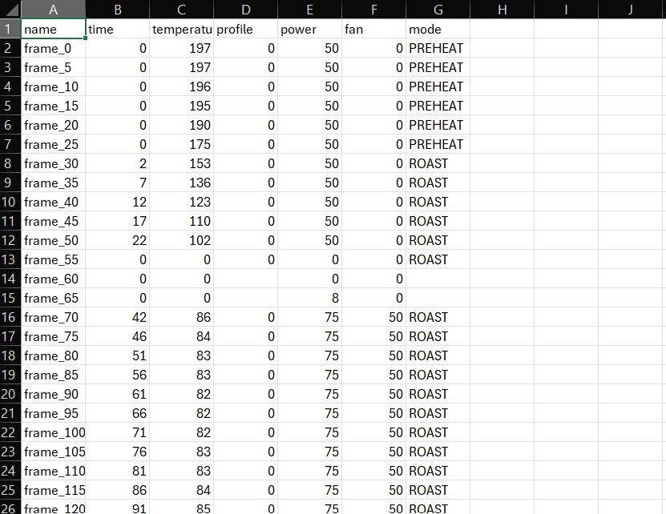

# Skylogger - Python, OpenCV2
An Itop Skywalker coffee roaster logger. 

Automatic extract roating profile using opencv2 and image masking to detect seven segment display digits from the coffee roaster control panel.



## Usage

1. Using Dev Container
2. runs with python3 main.py &lt;input video&gt; &lt;output path&gt;<br/>
   **Args**:
   | Arg | Description |
   | --- | ------------------------ |
   | --debug | Output debugging images [true|false] |
   | --masks | Directory with masks images. |
   | --rotate | Rotate image [auto|degree] |
   | --skip | Skip seconds from beginning of video |
   | --count | Number of frame to extract |

   Example:
    ```shell
    python3 main.py video.mp4 output --debug=true --masks=./masks --rotate=auto --skip=5 --count=10
    ```
## Operation Steps

### 1. Detect contours from the control panel


### 2. Group contours by row and column


### 3. Exract area of interests (monitoring area - TEMP / POWER / FAN)

<br/>
<br/>
<br/>

### 4. Extract Digits

|Digit 1|Digit 2|Digit 3|
|--|--|--|
||||

### 5. Detect Digits With Masks


### 6. Output


### 7. Sample output

[Result.csv](./assets/results.csv)


## What Next
- [ ] Cleanup panel reading - read digit and group them by panel area instead of checking for area of interest first
- [ ] Explore seven segment display detection with tesseract and custom training data.
